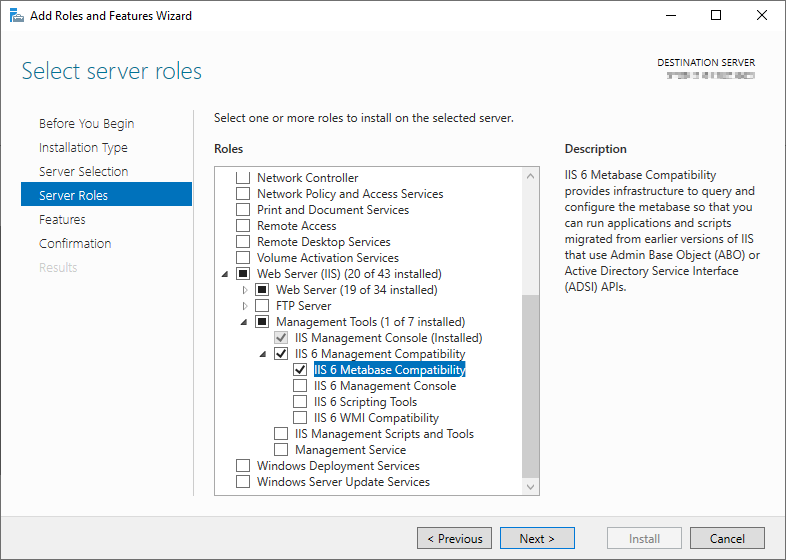

# Error while loading IIS Settings Information

## Problem

While trying to load a SharePoint 2019 farm with the enabled IIS Settings Information option, the following error message appears:

> IIS 6 Management Metabase Compatibility required.

The following error message is stored in the event log:

> Error while loading SP2019-SRV
>
> Acceleratio.SPCommon.SharePointCrawler.IISCompatibilityMissingException: IIS 6 Management Metabase Compatibility required. at Acceleratio.SPDocKit.Administration.IISSettingsLoader.IISMetabaseReader.GetAppPools(String serverAddress, ConfigReader configReader) at Acceleratio.SPDocKit.Administration.IISSettingsLoader.IISLoaders.IIS7Loader.Load() at Acceleratio.SPDocKit.Administration.ServerDetailsLoader.\#ca3.\#uZgb() at Acceleratio.SPCommon.TimeoutableAction.\#392.\#5Ygb()

## Solution

To successfully load IIS Settings, the IIS 6 Metabase Compatibility role has to be enabled.

:::warning
**Please note!**  
A server restart could be required for the changes to take effect.
:::

To enable the role, follow these steps:

1. Open the Server Manager on IIS server  
2. 1. On the Dashboard screen, select the **Add roles and features** option. **OR..**
   2. On the left side menu, click the **Local Server** option, navigate to the **Roles and Features** section, and select **Add Roles and Features** option in the **Tasks** drop-down menu on the right side of the screen. The **Add Roles and Features Wizard** opens.  
3. **Before You Begin** step - continue to the next step by clicking Next.  
4. **Installation Type** step - make sure the **Role-base or feature-based installation** option is selected.  
5. **Server Selection** step - make sure the IIS server is selected.  
6. **Server Roles** step - make sure the **IIS 6 Metabase Compatibility** option is checked. You can find it under Web Server (IIS) &gt; Management Tools &gt; IIS 6 Management Compatibility &gt; IIS 6 Metabase Compatibility.

1. **Features** step - continue to the next step.    
2. **Confirmation** step - check the **Restart the destination server automatically if required** option and click **Install**.    
3. **Results** step - displays the installation progress. Once the installation is finished, the **Installation succeeded** message is displayed. 

:::warning
**Please note!**  
Make sure to install the role on all Web Front End servers in a Farm in order to collect the IIS Settings Information.
:::

SPDocKit will now be able to collect the server's IIS Settings Information.

